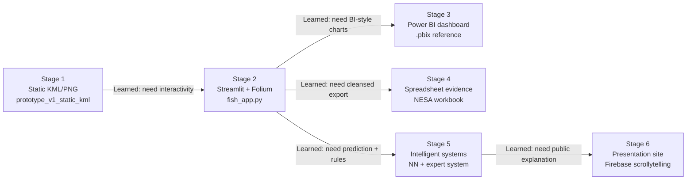

# 3.2.1b Producing and implementing — Prototypes

**Project:** AT3b Fish Finder enterprise system  
**Client need (from Part A):** Make game-fish tagging data easier to explore for anglers and researchers — where fish were released, when activity peaks, and how environmental context relates to catch patterns — including support for use in the field where internet access may be limited.

This document explains how **multiple prototypes** were produced, iterated, and incorporated into the final enterprise system. All earlier prototype files are **kept in the repository** (not deleted) so progressive development can be demonstrated in the walkthrough video and hand-in evidence.

---

## Overview: prototype progression



| Stage | Prototype type | Location | Role in final system |
|---|---|---|---|
| 1 | Static map overlay | `BasicProduction/prototype_v1_static_kml/` | Proof of concept — catch density on a map |
| 2 | Interactive dashboard | `BasicProduction/fish_app.py` | **Live enterprise dashboard** (core submission) |
| 3 | BI dashboard | `Dashboard-FishFinder.pbix copy` | Reference visualisation; screenshots in presentation site |
| 4 | Spreadsheet | `NESA_AT3b_Spreadsheet_Weather.xlsx` | Cleansed-data + formula evidence (`build_nesa_spreadsheet.py`) |
| 5 | Intelligent systems | `train_species_nn.py`, `certainty_factor.py` | Neural network + certainty-factor expert system in Streamlit |
| 6 | Presentation | `presentation_site/` | Explains prototypes and evidence to the marker (not the live app) |

--- 

## Prototype 1 — Static KML/PNG heatmap (Stage 1)

### What was built
The first working prototype aggregated tagging release locations into a **pre-rendered heatmap PNG** and a **KML overlay** opened in Google Earth (`main.py` → combined overlay; `species_heatmaps.py` → one overlay per species in `Species_Maps/`).

### Purpose (client need)
To test whether catch-density visualisation was even feasible before investing in a full web application. Anglers and researchers could see *where* activity clustered on the NSW coast.

### What was learned
- Visualisation worked, but **every filter change required regenerating files** — not acceptable for field use.
- Google Earth is not a practical daily tool for most anglers.
- No weather, moon, or species filtering without re-running scripts.
- No intelligent guidance — purely descriptive.

### Why it changed → Stage 2
Client need shifted from “can we see a heatmap?” to “can users **explore** the data interactively in a browser?” That justified building the Streamlit + Folium dashboard.

**Evidence kept:** `BasicProduction/prototype_v1_static_kml/` (runnable standalone; screenshots in `presentation_site/public/assets/images/prototypes/kml-prototype.png`).

---

## Prototype 2 — Streamlit + Folium interactive dashboard (Stage 2 → current core)

### What was built
A live, in-browser dashboard (`BasicProduction/fish_app.py`):
- **Folium/Leaflet** interactive map (pan, zoom, click).
- **Manual Entry** mode — species, year, month filters + Generate Map.
- **AI Assisted** mode — natural-language map requests (local Ollama/TinyLlama for offline summaries).
- Trip-distance ruler, GPX/KML export, boat-details panel for fuel/time estimates.
- **Map Rating sidebar** — user feedback stored for later intelligent-system rules.

### Purpose (client need)
Directly addresses the Part A requirement for an **interactive, filterable** tool usable **offline in the field** (local LLM, no cloud dependency for core map use).

### Iteration and feedback incorporated
| Issue found | Change made | Justification |
|---|---|---|
| Static prototype could not filter | Replaced PNG/KML with live Folium map | User must change species/season without re-running scripts |
| Raw CSV had bad coordinates | Data pipeline + cleaned dataset (`newfishdata/`) | Accurate map points |
| Users needed two workflows | Manual Entry + AI Assisted modes | Expert users vs quick natural-language requests |
| Field use needs offline AI | Local Ollama instead of cloud API | Client need: limited internet at sea |
| No way to capture “what worked” | Map Rating sidebar + saved prompts | Feeds **user preference match** rule in expert system (+15 CF) |

### What was learned
The dashboard became the **integration layer** for everything that followed: spreadsheet export, Power BI reference, neural network, what-if analysis, and certainty-factor evaluation all attach to this same app rather than separate silos.

**Evidence kept:** Run locally with `python3 -m streamlit run BasicProduction/fish_app.py`; screenshot `presentation_site/public/assets/images/prototypes/streamlit-dashboard.png`.

---

## Prototype 3 — Power BI dashboard (Stage 3)

### What was built
A Power BI dashboard (`Dashboard-FishFinder.pbix copy`) with BI-style charts, gauges, and filters over the same tagging data theme as the Streamlit app.

### Purpose (client need)
Demonstrates **enterprise visualisation** skills for stakeholders who expect dashboard-style reporting (heatmaps, species breakdowns, temporal trends) separate from the Python intelligent-systems submission surface.

### What was learned
- Streamlit is better for **interactive intelligent systems** (model panels, what-if controls).
- Power BI is better for **polished static dashboard storytelling** and NESA “construct visualisation” evidence.
- Both prototypes use the **same underlying data story** but serve different audiences: developers/anglers (Streamlit) vs presentation/markers (Power BI screenshots).

### Why both are kept
Neither replaces the other. The `.pbix` file stays in the repo unchanged; the presentation site references it through **screenshots only** (`presentation_site/public/assets/images/dashboard/` — placeholder until exported).

---

## Prototype 4 — Spreadsheet (`NESA_AT3b_Spreadsheet_Weather.xlsx`)

### What was built
`build_nesa_spreadsheet.py` generates an Excel workbook from the cleaned primary dataset:
- **18,225 rows** sampled after filtering to complete species, location, and weight.
- Column **P — `Weight_Classification`** with an Excel `IF` formula:  
  `=IF(H{row}>50, "Heavy Game Fish", "Standard")`
- Uses the same cleaned CSV lineage as the app and model (not the deprecated SST filter that dropped all rows).

### Purpose (assessment + client need)
- Satisfies **data cleansing** and **appropriate formulae** criteria.
- Gives non-technical users a familiar Excel view of the same records the dashboard uses.

### Iteration and feedback incorporated
| Issue found | Change made | Justification |
|---|---|---|
| Early script filtered on `Sea_Surface_Temp_C` (100% null) | Removed SST filter; use cleaned CSV | Spreadsheet had 0 rows — unusable evidence |
| Raw enriched file too large for workbook | Sample to 18,225 rows after quality filters | Practical file size for marker review |
| Needed formula evidence | Injected `IF` on weight column | Meets “appropriate formulae” requirement |

### What was learned
The spreadsheet prototype proved the **data pipeline produces analysable, formula-ready data** — the same foundation the intelligent systems depend on.

**Evidence:** `NESA_AT3b_Spreadsheet_Weather.xlsx`; screenshot placeholder `presentation_site/public/assets/images/spreadsheet/spreadsheet-screenshot.png`.

---

## Prototype 5 — Intelligent systems (Stage 5 — current)

Two **complementary** intelligent-system prototypes were built on the cleaned dataset and integrated into the Streamlit dashboard’s **AI Assisted** page.

### 5a — Neural network (predictive modelling)

**Built:** `train_species_nn.py` → `fish_species_nn.joblib`  
**Purpose:** Predict likely species from location, time, and weather/lunar features — fish-finding guidance from historical patterns.  
**Metrics:** 62.2% accuracy, 54.7% macro F1, 61.0% weighted F1; 10 features; 13 classes; train 33,152 / test 8,288.

**Iteration:**
| Issue | Fix | Learning |
|---|---|---|
| App used 4 hardcoded features; model trained on 10 | Dynamic `model_info['feature_columns']` | Prototype integration must match training pipeline |
| `Sea_Surface_Temp_C` 100% null | Dropped from model and enrichment active path | Do not train on broken features |
| Needed what-if evidence | `render_what_if_analysis_panel()` — baseline vs adjusted probabilities | Assessment requires explicit what-if analysis |

### 5b — Certainty-factor expert system (rule-based)

**Built:** `BasicProduction/certainty_factor.py` + planning docs (`scripts/IF-THEN.md`, `scripts/CertaintyFactors.md`, `scripts/certainty-factor-flowchart.mmd`, `scripts/certainty-factor-decision-tree.mmd`)  
**Purpose:** Readable IF-THEN reasoning a marker can follow step-by-step — complements the “black box” neural network.

**Rules (max 110):** Species +10, Season +25, Catch density +35/+20/+5, Location +25, User preference +15.  
**Bands:** ≥75 Strong, 45–74 Moderate, 1–44 Weak, 0 Insufficient.

**Feedback loop:** The Streamlit **Map Rating sidebar** (built in Stage 2) feeds the **user preference match** rule — a deliberate connection between early dashboard prototype and later expert system.

### What was learned
- **Two intelligent systems are stronger than one:** NN finds patterns; expert system explains *why* a recommendation is strong/moderate/weak.
- Prototypes must be **tested separately** (app startup, NN predict, what-if, CF rules, spreadsheet script, feature consistency) before claiming the enterprise system works end-to-end.

**Evidence:** Streamlit AI Assisted page; screenshots in `presentation_site/public/assets/images/neural-network/`, `what-if/`, `certainty-factor/`.

---

## Prototype 6 — Presentation site (communication layer)

### What was built
`presentation_site/` — Firebase Hosting scrollytelling site (11 sections, sticky visuals, screenshot evidence).

### Purpose
The **enterprise system runs locally in Streamlit**; the presentation site **explains** prototypes, data pipeline, intelligent systems, testing, and limitations to the marker without hosting models or CSVs.

### Connection to other prototypes
Each section maps to a prototype stage (problem → pipeline → KML → Streamlit → spreadsheet → Power BI → NN → what-if → expert system → testing → walkthrough).

---

## How prototypes connect to the final enterprise system

```text
Client need: explore tagging data + environmental context + guidance in the field
        │
        ▼
[Data pipeline prototypes] ──► Cleaned_Weather_GameFish_Releases_enriched.csv (41,440 rows)
        │                              │
        │                              ├──► Spreadsheet prototype (Excel evidence)
        │                              ├──► Power BI prototype (dashboard evidence)
        │                              └──► Streamlit fish_app.py (LIVE SYSTEM)
        │                                        │
        │                                        ├──► Map + filters + offline LLM
        │                                        ├──► Neural network + what-if
        │                                        └──► Certainty-factor expert system
        │
        └──► Static KML prototype (historical evidence of iteration)
        
Presentation site ──► Explains all of the above to the marker
```

---

## Reflection: design decisions linked to client needs

| Client need | Prototype decision | Outcome |
|---|---|---|
| See where fish were released | Stage 1 KML heatmap | Validated visualisation; led to interactive map |
| Filter by species/season without re-export | Stage 2 Streamlit | Manual + AI modes |
| Work offline at sea | Local Ollama, local Streamlit | No cloud required for core use |
| Understand data quality | Spreadsheet + pipeline CSVs at each stage | Provenance evidence preserved |
| Business-style reporting | Power BI dashboard | Separate visualisation prototype |
| Intelligent fishing guidance | NN + expert system | Prediction + explainable rules |
| Trust through transparency | What-if panel + CF rules table | User sees *why* scores change |
| Improve over time | Map Rating → user preference rule | Feedback incorporated into expert system |

---

## Suggested walkthrough order (for video / marker)

1. **Static KML prototype** — show `overlay_image.png` / species overlay; explain limitations.
2. **Streamlit dashboard** — Manual Entry filters → map; AI Assisted mode.
3. **Spreadsheet** — open workbook; show `Weight_Classification` formula.
4. **Power BI** — dashboard screenshots (`.pbix` reference only).
5. **Neural network** — metrics, confusion matrix, example prediction.
6. **What-if analysis** — change month/wind → compare baseline vs adjusted.
7. **Certainty-factor expert system** — evaluate rules; show score and band.
8. **Presentation site** — scroll through scrollytelling evidence.

---

## Mapping to rubric (3.2.1b — target: Extensive, 10–8 pts)

| Rubric element | Evidence in this project |
|---|---|
| Extensive use of **multiple prototypes** (spreadsheet, dashboard, intelligent system) | Six stages documented above; files retained in repo |
| Purpose and evolution explained in detail | Per-stage: built / learned / changed / client link |
| Progressive development | KML → Streamlit → BI + spreadsheet → intelligent systems → presentation |
| Iteration, feedback, justified changes | SST removal, feature-alignment fix, spreadsheet filter fix, Map Rating → CF rule |
| What was built, learned, why changed | Each section above |
| Deep reflection → user/client needs | Reflection table + offline/field-use rationale |

---

## Related files

| Document | Content |
|---|---|
| [PROTOTYPE_EVOLUTION.md](PROTOTYPE_EVOLUTION.md) | Technical stage-by-stage history |
| [INTELLIGENT_SYSTEMS_IMPLEMENTATION.md](INTELLIGENT_SYSTEMS_IMPLEMENTATION.md) | NN + expert system detail |
| [DATA_REFRESH_WORKFLOW.md](DATA_REFRESH_WORKFLOW.md) | Dataset pipeline lineage |
| [presentation_site/public/index.html](presentation_site/public/index.html) | Scrollytelling prototype evidence (§1–11) |
